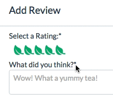

# Camellia

[Camellia Live!][heroku]

[heroku]: https://camellia.io/

Camellia is a web application built using Ruby on Rails and React.js meant for reviewing teas and managing personal tea inventories. The underlying structure of the application is inspired by [Couchsurfing](https://www.couchsurfing.com/), though the functionality is vastly different.

## The Vision

The vision? Tea site. Site for teas. Find teas on the site. Find good teas. Avoid bad teas. Keep track of these teas so you don't have to remember them.

How? Store those teas in a relational DB. Implement a clean on concise back-end in Rails to take advantage of the powerful tools already available (model associations, rails router for api calls, ActiveRecord relations). Rely on a JavaScript front-end to make the site dynamic and interactive. However, the user interactions should be simple and straightforward as well - which lends itself to a single page app. Teas are complicated, though, so this was best accomplished using React and the Flux pattern to keep track of data for the client.

## Tools
  - [Ruby/Rails+ActiveRecord](http://rubyonrails.org/)
  - [jbuilder](https://github.com/rails/jbuilder)
  - [jQuery](http://jquery.com/)
  - [React.js](https://facebook.github.io/react/)
  - [React Router](https://github.com/reactjs/react-router)
  - [Cloudinary](http://cloudinary.com/documentation) _(for image hosting)_

## These are some things Camellia has/does:
  - Hand-rolled Auth _(for learning! Because that's just a terrible idea overall.)_
  - Single page app with client-side routing
  - Tea profile pages _(which have info about that tea! Naturally!)_
  - Tea Reviews
  - Tea Inventory _(which is a list of teas you own! Wow-oh-wow-oh-wow!)_
  - Flux data flow used for all major features
  - Aggregate user steep preferences for teas

## These are the things I care about:

### Type-Ahead tea search by name/description and region/leaf type
Each search is implemented in a slightly different way, but the UI is consistent for each.

**The break-down:** Teas has names and descriptions, are from a specific country, and are given a category based on processing and color (black, green, herbal, etc). Each tea is stored in the database as a single row with each of these attributes as represented as a column in the table. However, the regions and types are limited, so the list cannot change as new teas are added to the database.

The search bar is type-ahead, so search suggestions are populated as the user types. The search suggestions are links, but submitting the search form will offer all available search results.

#### Name/Description
The model-level method below is responsible for the logic around both search suggestions and search results. The method is called from the `TeasController` and `SearchSuggestionController`, which different parameters which determine what type of result to spit back. The search is fairly simple, checking for one-to-one matches without ranking the results.

```Ruby
# app/models/tea.rb

def self.search(parameters, limit = nil)
  if parameters[:tea]
    # 'tea' will only be a key of parameters if users are searching under the tea field
    teas = Tea.where("UPPER(name) LIKE :search_parameters OR UPPER(description) LIKE :search_parameters", {search_parameters: '%' + parameters[:tea].upcase + '%'}).includes(:reviews)
  else
    # these will be direct searches for region or tea_type - this was made to accommodate other search fields in future
    query_string = ''
    parameters.each do |key, value|
      query_string = query_string + 'UPPER(' + key + ')' + ' LIKE ' + "'%#{value.upcase}%'"
    end
    teas = Tea.where(query_string).includes(:reviews)
  end

  if limit
    # limit param determines whether a suggestion is needed or not
    selector = 'id, description, name as search_name'
    suggestion_type = 'tea'
    return [teas.limit(limit).select(selector), suggestion_type]

  else
    # returns full tea detail
    return teas
  end
end
```

You'll note that either description or name can be matched to the user's query. Using JS, a portion of the description is displayed based on whether this was the field that matched the search result.

#### Region / Tea Type
Because Region and Tea Type are fixed, the potential search suggestions for these options will always be the same. When the search bar component requests search suggestions (using `SearchSuggestionActions`), any region or tea type requests are processed within a private method in `SearchSuggestionActions` rather than getting pulled from the server.  

```js
// frontend/actions/search_suggestion_actions.js

function _getMatchingCategories(searchType, query) {
  const matchers = [];

  // find correct constant to search
  let categories;
  switch (searchType) {
    case 'region':
      categories = TeaConstants.ALL_REGIONS
      break;
    case 'tea_type':
      categories = TeaConstants.ALL_TYPES
      break;
    default:
  }

  // find matching values
  let i = 0;

  while (matchers.length < 5 && i < categories.length) {
    if ( categories[i].toLowerCase().match(query.toLowerCase()) ) {
      const suggestion = {
        suggestion: categories[i],
        suggestion_type: searchType
      }
      matchers.push(suggestion);
    }
    i++
  }

  return matchers;
}
```


### Custom tea-rating selector  
The rating selector for Camellia is stinking adorable.



It's pretty much all css and dynamic class assignment in JS. There are three layers of content for the selector - two backgrounds (one showing a 0-star rating, one showing a 5-star rating) and an unordered list of elements.

Each list element corresponds to a rating. On mouse-over, the class applied to the unordered list is updated, resetting the state of the form component, and re-rendering that chunk of the screen. The class applied to the unordered list determines the width of the background showing a 5-star rating, making it appear to be anywhere between one and five stars.

```js
// frontend/components/review_form.jsx

let ratingSelector = (
  <div className='rating-container' >
    <div className={'rated--by-current-user rating-selector ' + this.state.ratingClass}>
    </div>
    <ul className={'rating-selection-fields'} onMouseOut={event => this._updateClass(event, this.state.rating)}>
      <li className='li1' onMouseEnter={(event) => this._updateClass(event, 1)} onClick={(event) => this._handleInput(event, 'rating', 1)}></li>
      <li className='li2' onMouseEnter={(event) => this._updateClass(event, 2)} onClick={(event) => this._handleInput(event, 'rating', 2)}></li>
      <li className='li3' onMouseEnter={(event) => this._updateClass(event, 3)} onClick={(event) => this._handleInput(event, 'rating', 3)}></li>
      <li className='li4' onMouseEnter={(event) => this._updateClass(event, 4)} onClick={(event) => this._handleInput(event, 'rating', 4)}></li>
      <li className='li5' onMouseEnter={(event) => this._updateClass(event, 5)} onClick={(event) => this._handleInput(event, 'rating', 5)}></li>
    </ul>
    <div className='height-giver' />
  </div>
)
```

### Image upload through standard input tag
Uploading images - sounds mundane. But getting documents to upload from HTML forms to the Rails backend is a little tricky, as the same data types cannot be used for documents as for standard text/number content.

Cloudinary, the service I used to host Camellia's images, offers a widget to abstract away the the details of this process. However, it's ugly and would have taken a Camellia user out of the experience of the site.

Eww. So gross. ---> 

Cute. So sleek. ---> 

The trick to this was using the [FormData](https://developer.mozilla.org/en-US/docs/Web/API/FormData) web-api. Upon upload, the image is a [File](https://developer.mozilla.org/en-US/docs/Web/API/File) object, and has to be treated as such.

```js
// frontend/utils/tea_api_util.js

createTea: function (tea, callback, errorCallback) {
  const data = new FormData();
  Object.keys(tea).forEach( (property) => {
    if (property === 'image') {
      data.append(`tea[${property}]`, tea[property], tea[property].name)
    } else {
      data.append(`tea[${property}]`, tea[property])
    }
  })

  $.ajax({
    type: 'POST',
    url: 'api/teas',
    contentType: false,
    cache: false,
    processData: false,
    data: data,
    success: callback,
    error: (err) => errorCallback('newTea', err)
  })
```
The FormData object created in the ajax call gets passed directly as the data of the request (it cannot be a value in a key-value pair). The `contentType` parameter must be changed to either `false` or `multipart/form-data` in order to ensure that jQuery does undo all your hard work to transfer the file. `processData` also needs to be set to false so that jQuery does not transform the data into a query string. `cache` is set to false for browser compatibility, but should not impact functionality in modern browsers.

## The Future
While Camellia at it's current stage is ultimately a learning project, I have plans to build it out into a site with real usability and reach. The primary goals are to add several main features.

### Stats
If users have the ability to track the teas they drink and when, Camellia will be able to process this data, and return meaningful charts and graphs to the user. There are quite a few utilities out there which make transforming this data possible, but further research will be required to nail down a course of action. Ultimately, Camellia will be able to offer tea suggestions based on your and similar users' drinking habits.

### Social
The ability for users to follow other users and keep tabs on what other people are drinking is critical. This will take Camellia from a resource to a community. This should be a fairly simple feature, adding an additional component to the flux cycle.
